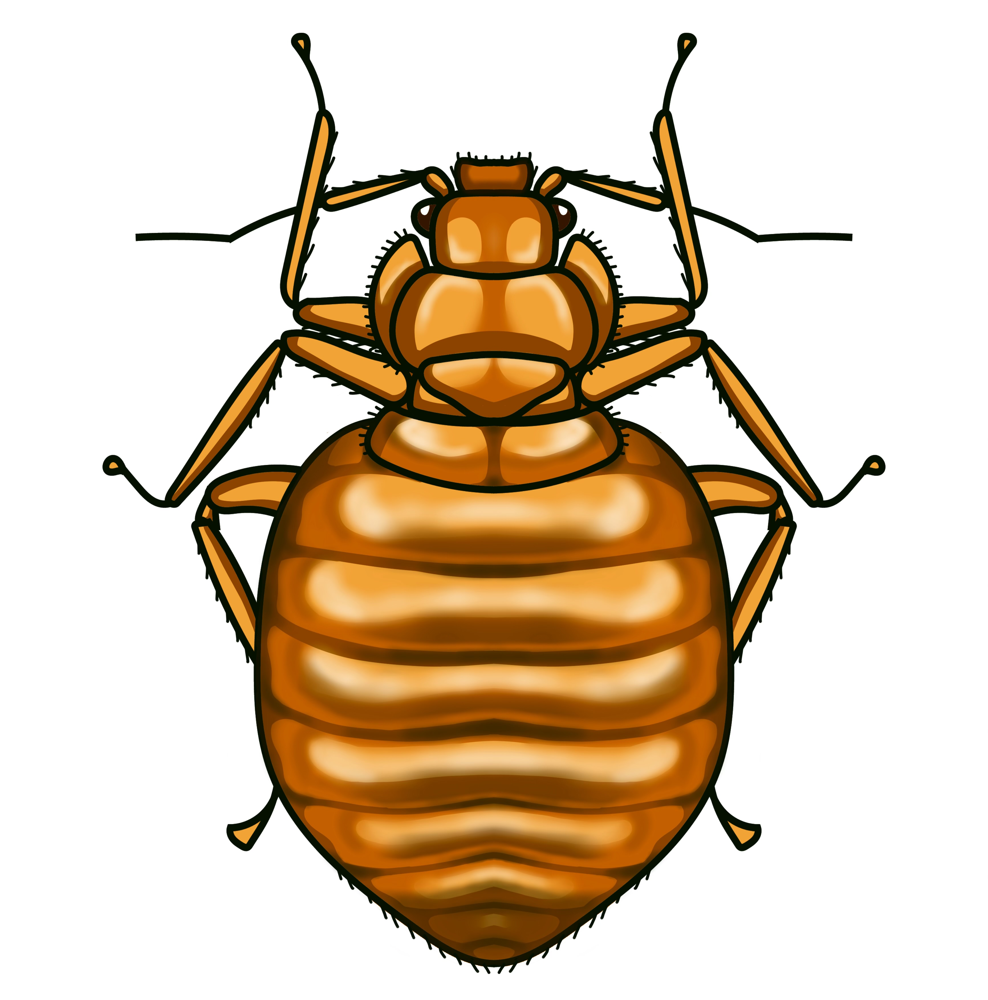

<!-- Left Column: Image -->

  {width=250}

<!-- Right Column: Text -->

  We are broadly interested in developing sustainable urban pest management solutions through interdisciplinary research. Our lab uses diverse approaches – molecualr diagnostics,population genomics, biochemistry, and bioinformatics – to investigate how detection, behavior, and reproduction shape urban insect pest resilience. We also integrate socioeconomic research on pest prevalence to create comprehensive, eco-friendly management strategies

---

## Some areas of focus are:
- Detecting bed bug infestations before they are visible using environmental DNA (eDNA) diagnostics
- Mapping how bed bugs spread across Ohio cities and how they discriminate between hosts
- Investigating how the bacterial symbiont *Wolbachia* shapes bed bug reproduction

## The Oladipupo Lab News

- **May 2026**: Graduate students **Abdulafees Hamzat** and **Grace Amponsah** co-author the _Bed Bug Look-Alikes_ Ohioline fact sheet with **Seun**
- **April 7, 2026**: Nina Brown presents her Honors thesis at the College of Publich Health Undergraduate Research Symposium
- **October 2025**: **Seun** named to **Auburn University's 2025** class of [20 Under 40 Alumni](https://alumni.auburn.edu/alumni-awards/20-under-40-recognition/)
- **September 12, 2025**: Our paper, _Deubiquitylases and nucleases in bacterial symbiont-induced cytoplasmic incompatibility_, got accepted in [Biochemical Society Transactions](https://doi.org/10.1042/BST20253047)
- **July 24, 2025**: Manuscript from meta-analysis class by Prabath Mudiyanselage, _Does growing latitude influence soybean seed critical amino acid content? A meta-analysis_ was accepted in [Agricultural and Environmental Letters](https://acsess.onlinelibrary.wiley.com/journal/24719625)
- Our featured story, _Don’t let bed bugs crash your vacation_, was the number one headline for Thursday, July 24, 2025. [Read more on the CFAES page](https://cfaes.osu.edu/news/articles/don%e2%80%99t-let-bed-bugs-crash-your-vacation-cfaes-tackles-the-threat-in-ohio?category=Headline%20news&utm_source=sfmc&utm_medium=email&utm_campaign=omc_faculty-staff-newsletter_fy26_oncampus-20250724&sfmc_key=0032E00002tKwznQAC)
- **June 02, 2025**: Undergraduates, Nina Brown and Ashely Hamby, join the lab to work on [Mapping Inequities Seed Grant](https://ugresearch.osu.edu/research-postings/mapping-inequities-data-driven-approach-understanding-and-combating-bed-bug)
- **May 30, 2025**: Visiting Scholar, Damilola Gbore, joins Cambridge University. Best wishes, Damilola!
- **May 2, 2025**: _Mapping Inequities Seed Grant_ awarded. Funded by **Kirwan Institute!**
- **April 17, 2025**: Incoming graduate student, **Abdulafeez Hamzat**, awarded a University Fellowship to support his Master's research
- **March 12, 2025**: **Seun** gave a Wooster Science Café calk titled [_The Science of the Unseen_](https://www.woostersciencecafe.org/talks/the-science-of-urban-ecology-and-pest-management)
- **March 10, 2025**: Our collaborative work on [_Origins of Cin_](https://www.biorxiv.org/content/10.1101/2025.03.04.641471v1.full) is available on **BioRxiv**
- **March 06, 2025**: **Seun** presented on cockroach control at [Structural and Vertebrate Pest Webinar](https://pested.osu.edu/events/structural-and-vertebrate-pests-webinar-march-6-2025)
- **January 06, 2025**: Visiting scholar, **Damilola Gbore**, joins our lab
- **August 15, 2024**: The Oladipupo Lab door opened at [The Ohio State University](https://www.osu.edu/)

## Other Major Media
- The bed bug threat, [Ohioline](https://ohioline.osu.edu/factsheet/ent-0103)
- How to (wisely! safely!) pick out free furniture off the curb, [The Washington Post](https://www.washingtonpost.com/home/2025/05/20/how-to-get-furniture-off-the-curb/)
- _Wolbachia_ in cockroaches: a new paradigm for urban pest management? [Entomology Today](https://entomologytoday.org/2023/06/15/wolbachia-cockroaches-new-paradigm-urban-pest-management/)
- Essential oils: an untapped resource for managing urban insect pests, [Entomology Today](https://entomologytoday.org/2022/07/14/essential-oils-untapped-resource-managing-urban-insect-pests/)
- Killing cockroaches with pesticides is only making the species stronger, [National Geographic](https://www.nationalgeographic.com/animals/article/pesticides-are-making-german-cockroaches-stronger/)
