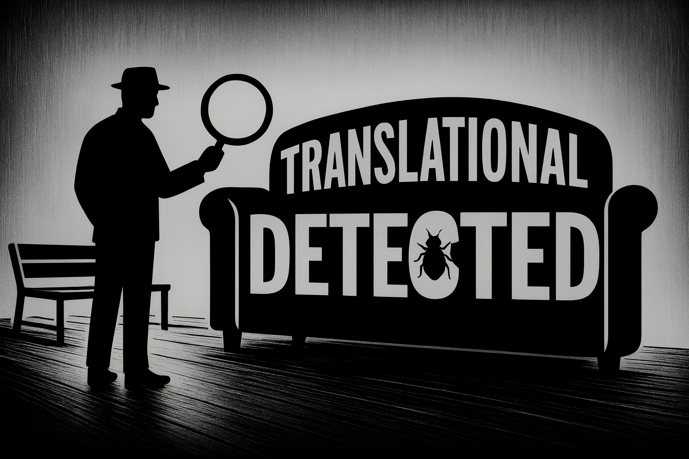
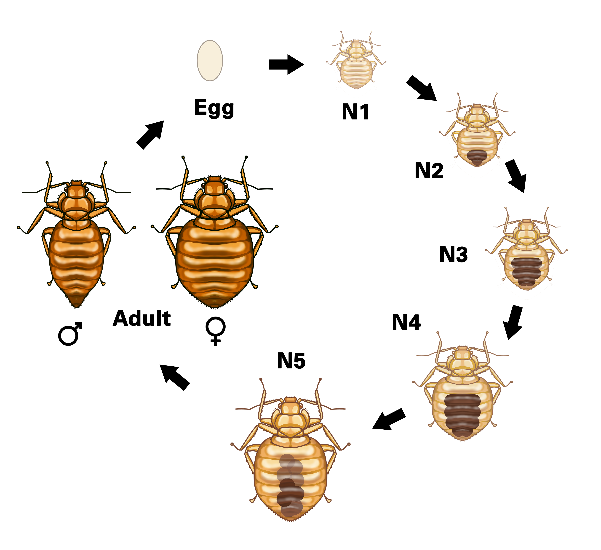
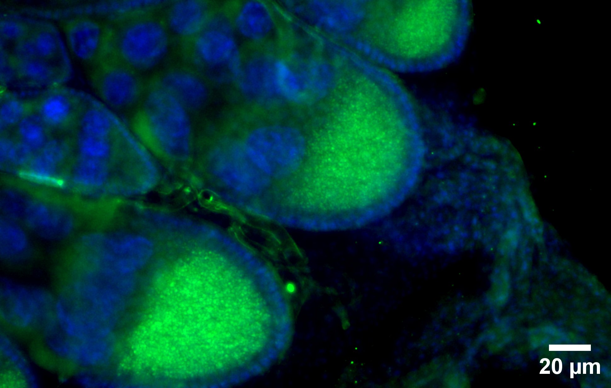

## Find them before you see them

Once established, bed bugs are extraordinarily difficult to eradicate. They are nocturnal, tiny, and expert at hiding, so most infestations are only caught once populations are large, when treatment becomes expensive, stressful, and socially stigmatizing, and falls hardest on households with the fewest resources to absorb it

We are building **environmental-DNA (eDNA) diagnostics** that detect bed bug presence from a simple room swab, before a single insect is visible. The workflow is built for the field rather than the lab i.e., short turnaround, minimal equipment, a protocol that pest management professionals and housing managers can run on-site. In mature form, it converts an invisible problem into an actionable one before it spreads

## Map how they spread, and how they find us

Ohio leads the nation in the top-50 list of bed bug cities. Notably, Columbus, Cincinnati, and Cleveland, linked by Interstate 71, consistently place in the top twenty. How infestations move between these cities, and how bed bugs choose which human to bite, are both poorly understood

Using **population genomics and spatial epidemiology**, we are interested in reconstructing how bed bug infestations disperse across Ohio's urban corridor. We are exploring whether transit routes like I-71 function as transmission highways. Because infestations track housing instability, the dispersal map we build is as much an equity map as a biological one, showing stakeholders where resources are most needed

A parallel line asks a different question. Bed bugs carry **fewer olfactory receptor genes** than almost any blood-feeding insect that does not live on its host, yet they discriminate efficiently between warm-blooded humans. We investigate the chemical cues that drive that discrimination

## Test whether a bacterium shields females from violent mating

Bed bug mating is unusual, even for insects. Males pierce the female's abdomen during copulation and deposit sperm into her body cavity (a phenomenon called **traumatic insemination**). Females should suffer steep fitness costs. They largely do not

*Wolbachia*, a bacterium that lives inside bed bug cells, supplies B-vitamins the insect cannot produce on its own. We hypothesize that *Wolbachia* role may extend well beyond nutrition. Thus, we investigate whether *Wolbachia* **buffers wound females against the physical damage** of traumatic insemination

