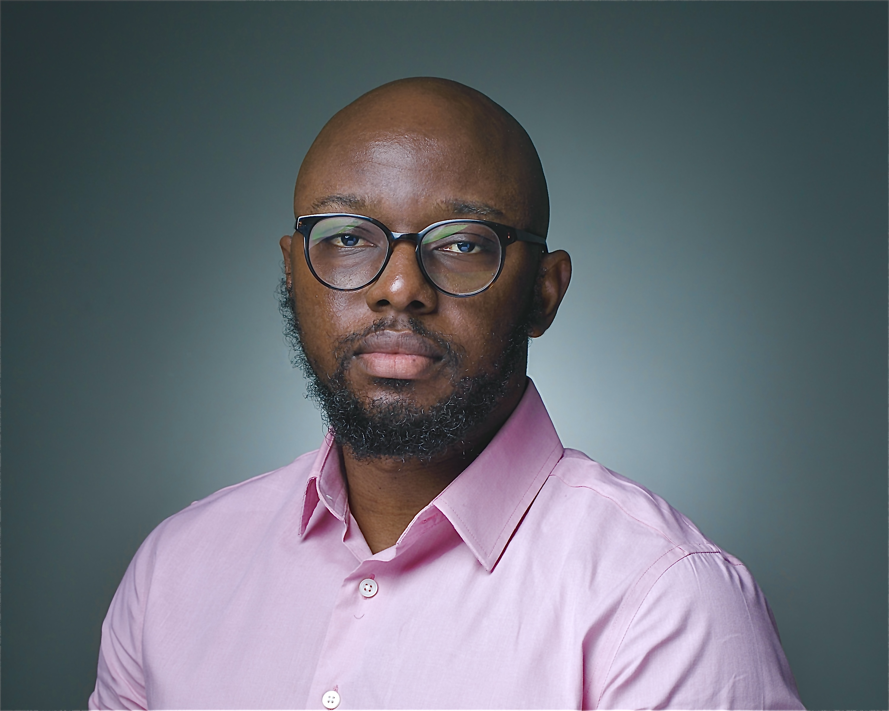
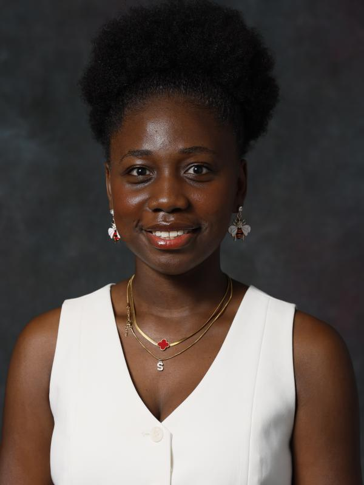
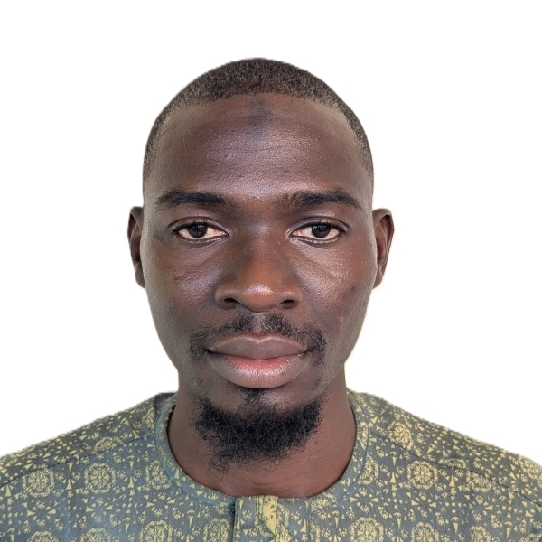
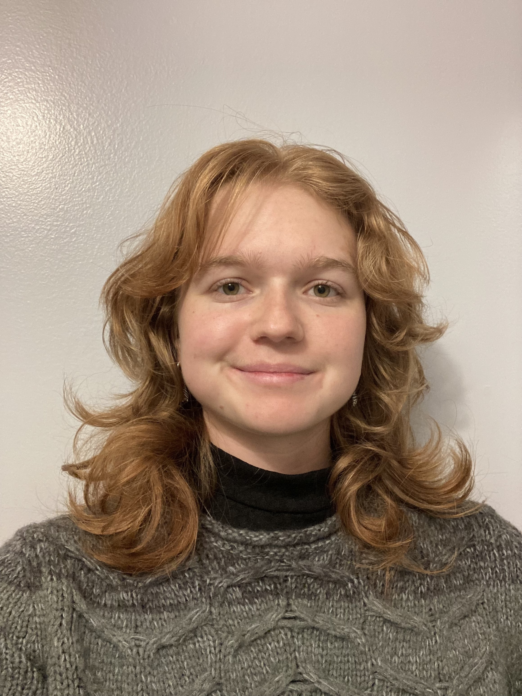
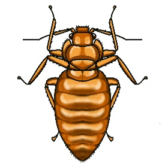
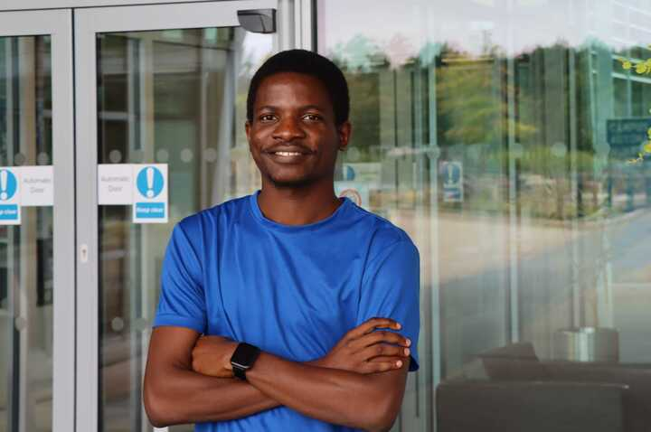

# Principal Investigator

<table>
  <tr>
    <td style="padding-right: 20px;">
      
    </td>
    <td>
      <strong>Seun Oladipupo</strong> 
      <em>Assistant Professor, Urban Entomology</em> 
      <a href="mailto:Oladipupo.7@osu.edu">Oladipupo.7@osu.edu</a> |
      <a href="https://drive.google.com/file/d/1VLsfViqfZGSVD9h-mnMmg5xrhFpoupQj/view?usp=drive_link">CV</a>
    </td>
  </tr>
</table>

# Students

  
  

  <strong>Grace Amponsah</strong> 
  <em>PhD student, ESGP</em> 
  <a href="mailto:amponsah.37@buckeyemail.osu.edu">amponsah.37@buckeyemail.osu.edu</a>
  

  
  

  <strong>Abdulafees Hamzat</strong> 
  <em>MS student, Entomology</em> 
  <a href="mailto:hamzat.6@buckeyemail.osu.edu">hamzat.6@buckeyemail.osu.edu</a>
  

  
  

  <strong>Nina Brown</strong> 
  <em>Undergraduate student, Public Health</em> 
  <a href="mailto:brown.8698@buckeyemail.osu.edu">brown.8698@buckeyemail.osu.edu</a>
  

  
  

  <strong>Ashely Hamby</strong> 
  <em>Undergraduate student, Entomology</em> 
  <a href="mailto:hamby.52@buckeyemail.osu.edu">hamby.52@buckeyemail.osu.edu</a>
  

# Alumni

  
  

  <strong>Damilola Gbore</strong> 
  <em>Visiting Scholar (Spring 2025)</em> 
  Advanced to doctoral study at the University of Cambridge
  

  
  

  <strong>Thomas Salawu</strong> 
  <em>International Research Mentee (Spring–Fall 2025)</em> 
  M.Tech, Federal University of Technology, Akure (defended August 2025)
  

# Lab life

<figure style="flex: 1 1 30%; margin: 0;">
  
  <figcaption style="text-align: center; font-size: 0.9em; margin-top: 8px; font-weight: bold;"><em>Nina Brown presents her Honors thesis at the OSU Undergraduate Research Symposium (April 2026).</em></figcaption>
</figure>

<figure style="flex: 1 1 30%; margin: 0;">
  
  <figcaption style="text-align: center; font-size: 0.9em; margin-top: 8px; font-weight: bold;"><em>The team celebrates Nina's Honors defense.</em></figcaption>
</figure>

<figure style="flex: 1 1 30%; margin: 0;">
  
  <figcaption style="text-align: center; font-size: 0.9em; margin-top: 8px; font-weight: bold;"><em>End-of-year lab meeting, 2025.</em></figcaption>
</figure>

